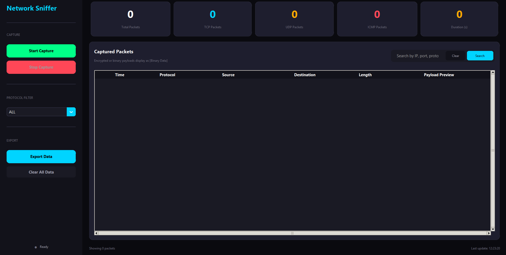
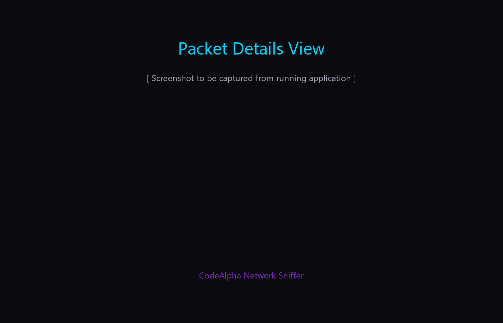

# Network Sniffer
Packet capture performance may vary depending on network traffic volume and Windows permissions.
A modern, interactive network packet capture tool built for cybersecurity education and professional training. This desktop application provides real-time packet analysis with a sleek, intuitive interface.


---

## Overview

A practical network analysis tool that demonstrates core networking concepts while providing real utility for packet inspection and traffic monitoring. Built as a cybersecurity portfolio project.

The sniffer captures live network traffic and presents it in an organized, filterable interface. It supports multiple protocols and provides detailed packet analysis capabilities.

---

## Features

### Live Packet Capture
- Real-time packet sniffing using Scapy
- Non-blocking threaded capture engine
- Automatic packet parsing and classification
- Support for TCP, UDP, ICMP, and HTTP traffic

### Protocol Analysis
- **TCP**: Full header inspection with flag analysis
- **UDP**: Port and payload examination
- **ICMP**: Type and code interpretation
- **HTTP**: Request/response detection and parsing

### Interactive Controls
- Start/Stop capture with animated buttons
- Protocol filtering (TCP, UDP, ICMP, ALL)
- Advanced search across all packet fields
- Real-time statistics dashboard

### Data Management
- Export captured packets to JSON or TXT with custom save location
- Persistent log storage
- Clear data functionality
- Packet details inspection dialog

### Modern UI/UX
- Dark cybersecurity-themed interface
- CustomTkinter for native Windows styling
- Animated counters and status indicators
- Smooth hover effects and transitions
- Responsive layout adapting to window size

---

## Screenshots

### Main Interface


### Packet Details View


---

## Installation

### Prerequisites
- Windows 11 (primary target platform)
- Python 3.11 or higher
- Administrator privileges (required for packet capture)
- Npcap or WinPcap driver

### Setup Steps

1. **Clone the repository**
   ```bash
   git clone https://github.com/abdulrhmansaad456eg/CodeAlpha_Basic-Network-Sniffer.git
   cd CodeAlpha_Basic-Network-Sniffer
   ```

2. **Install Python dependencies**
   ```bash
   pip install -r requirements.txt
   ```

3. **Install Npcap (if not already installed)**
   - Download from https://npcap.com/
   - Run installer with "WinPcap API-compatible Mode" enabled
   - Restart your computer

4. **Run the application**
   ```bash
   # Right-click terminal and select "Run as Administrator"
   python main.py
   ```

---

## Usage

### Starting a Capture
1. Launch the application as administrator
2. Select your desired protocol filter (default: ALL)
3. Click "Start Capture"
4. Watch packets appear in real-time

### Analyzing Packets
- Double-click any packet to view detailed information
- Use the search bar to filter by IP, port, or payload content
- Check the stats cards for protocol distribution

### Exporting Data
1. Click "Export Data" in the sidebar
2. Select your preferred format (JSON or TXT)
3. Click "Confirm Export"
4. Choose your save location in the file picker
5. The file is saved to your selected location

### Keyboard Shortcuts
- `Enter` on selected packet - Open details
- Search bar supports live filtering

---

## Technologies Used

| Component | Technology |
|-----------|------------|
| Language | Python 3.11+ |
| Packet Capture | Scapy 2.5+ |
| GUI Framework | CustomTkinter |
| Utilities | psutil, Pillow |
| Styling | Native Windows dark theme |

---

## Learning Outcomes

Through this project, I gained practical experience with:

- **Network Protocols**: Deep understanding of TCP/IP stack, packet structures, and protocol behaviors
- **Scapy Framework**: Mastered packet crafting, sniffing, and manipulation
- **Threading**: Implemented safe concurrent packet capture without UI freezing
- **Desktop UI Development**: Built responsive interfaces with modern design principles
- **Error Handling**: Managed permission issues, driver dependencies, and network errors
- **Data Processing**: Efficient parsing and filtering of network data streams

---

## Project Structure

```
CodeAlpha_Basic-Network-Sniffer/
├── assets/
│   ├── icons/
│   ├── themes/
│   └── animations/
├── core/
│   ├── sniffer.py          # Packet capture engine
│   ├── packet_parser.py     # Packet analysis utilities
│   ├── filters.py           # Search and filter logic
│   └── exporter.py          # Export functionality
├── ui/
│   ├── main_window.py       # Main application window
│   ├── widgets.py           # Custom UI components
│   ├── styles.py            # Theme and styling
│   └── dialogs.py           # Popup dialogs
├── logs/                    # Exported capture files
├── tests/                   # Unit tests
├── screenshots/             # Application screenshots
├── main.py                  # Entry point
├── requirements.txt         # Dependencies
└── README.md               # This file
```

---

## Troubleshooting

### "No permission to capture packets"
Run the application as administrator. Packet capture requires elevated privileges on Windows.

### "Npcap not found"
Install Npcap from https://npcap.com/ and restart your computer.

### "No traffic appearing"
- Check your network connection
- Try generating traffic: open a browser, ping a website
- Verify firewall settings

### Application crashes on start
- Ensure all dependencies are installed: `pip install -r requirements.txt`
- Check Python version (3.11+ required)
- Verify Windows 11 compatibility

---

## Future Improvements

- [ ] Packet capture to PCAP file format
- [ ] Protocol-specific analysis views
- [ ] Network graph visualization
- [ ] Rule-based alerting system
- [ ] Historical trend analysis
- [ ] Cross-platform Linux support
- [ ] Plugin system for custom protocols

---

## License

This project is licensed under the MIT License - see the [LICENSE](LICENSE) file for details.

---

## Acknowledgments

- The open source community for excellent tools and libraries
- Scapy developers for the excellent packet manipulation framework
- CustomTkinter team for modern Python UI components

Project Link: [https://github.com/abdulrhmansaad456eg/CodeAlpha_Basic-Network-Sniffer](https://github.com/abdulrhmansaad456eg/CodeAlpha_Basic-Network-Sniffer)

---

*Built with dedication for cybersecurity education and professional development.*
